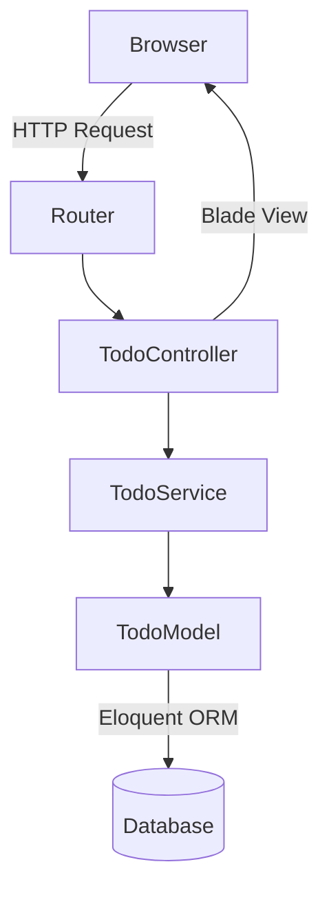

# 設計書

## 概要

本ドキュメントは、cc-sdd（仕様駆動開発）デモ用WebアプリケーションのLaravel実装における技術設計を定義します。

アプリはシンプルなTODO管理機能（一覧・作成・ステータス更新・削除）を提供し、勉強会参加者がcc-sddのワークフローを体験するためのデモ素材として機能します。

### 技術スタック

- PHP 8.2+
- Laravel 11.x
- SQLite（開発・デモ用）/ MySQL（本番対応）
- Blade テンプレートエンジン
- Tailwind CSS（CDN経由）

---

## アーキテクチャ

Laravel標準のMVCアーキテクチャに従います。



### レイヤー構成

| レイヤー | 役割 | 実装クラス |
|---|---|---|
| Routing | URLとコントローラーのマッピング | `routes/web.php` |
| Controller | HTTPリクエスト処理・バリデーション委譲・レスポンス返却 | `TodoController` |
| Service | ビジネスロジック（CRUD操作） | `TodoService` |
| Model | Eloquent ORMモデル・DBアクセス | `Todo` |
| View | Bladeテンプレートによる画面描画 | `resources/views/todos/` |

---

## コンポーネントとインターフェース

### ルーティング (`routes/web.php`)

```
GET    /           → redirect to /todos
GET    /todos      → TodoController@index
GET    /todos/create → TodoController@create
POST   /todos      → TodoController@store
PATCH  /todos/{id}/status → TodoController@updateStatus
DELETE /todos/{id} → TodoController@destroy
```

### TodoController

```php
class TodoController extends Controller
{
    public function __construct(private TodoService $service) {}

    // GET /todos - Todo一覧表示
    public function index(): View;

    // GET /todos/create - 作成フォーム表示
    public function create(): View;

    // POST /todos - Todo作成
    public function store(StoreTodoRequest $request): RedirectResponse;

    // PATCH /todos/{id}/status - ステータス更新
    public function updateStatus(UpdateTodoStatusRequest $request, int $id): RedirectResponse;

    // DELETE /todos/{id} - Todo削除
    public function destroy(int $id): RedirectResponse;
}
```

### FormRequest クラス

**StoreTodoRequest**
- `title`: required, string, max:255
- `description`: nullable, string, max:1000

**UpdateTodoStatusRequest**
- `status`: required, in:pending,in_progress,done

### TodoService

```php
class TodoService
{
    public function getAllTodos(): Collection;
    public function createTodo(array $data): Todo;
    public function updateStatus(int $id, string $status): Todo;
    public function deleteTodo(int $id): void;  // throws ModelNotFoundException
}
```

### Bladeビュー構成

```
resources/views/
├── layouts/
│   └── app.blade.php       # 共通レイアウト
└── todos/
    ├── index.blade.php     # 一覧画面（ステータス更新・削除フォーム含む）
    └── create.blade.php    # 作成フォーム画面
```

---

## データモデル

### todosテーブル

| カラム | 型 | 制約 | 説明 |
|---|---|---|---|
| id | BIGINT UNSIGNED | PK, AUTO_INCREMENT | 主キー |
| title | VARCHAR(255) | NOT NULL | TODOタイトル |
| description | TEXT | NULLABLE | 詳細説明 |
| status | ENUM('pending','in_progress','done') | NOT NULL, DEFAULT 'pending' | ステータス |
| created_at | TIMESTAMP | NOT NULL | 作成日時 |
| updated_at | TIMESTAMP | NOT NULL | 更新日時 |

### Todoモデル

```php
class Todo extends Model
{
    protected $fillable = ['title', 'description', 'status'];

    protected $casts = [
        'status' => TodoStatus::class,  // PHP8.1 Backed Enum
    ];
}
```

### TodoStatus Enum

```php
enum TodoStatus: string
{
    case Pending    = 'pending';
    case InProgress = 'in_progress';
    case Done       = 'done';
}
```

### Migration

```php
Schema::create('todos', function (Blueprint $table) {
    $table->id();
    $table->string('title', 255);
    $table->text('description')->nullable();
    $table->enum('status', ['pending', 'in_progress', 'done'])->default('pending');
    $table->timestamps();
});
```

### Seeder

デモ用に3件のサンプルTodoを投入します。

```php
Todo::insert([
    ['title' => 'cc-sddの要件定義書を読む', 'status' => 'done', ...],
    ['title' => '設計書を確認する',         'status' => 'in_progress', ...],
    ['title' => 'タスクリストを実装する',   'status' => 'pending', ...],
]);
```

---

## 正確性プロパティ

*プロパティとは、システムのすべての有効な実行において成立すべき特性または振る舞いのことです。つまり、システムが何をすべきかについての形式的な記述です。プロパティは人間が読める仕様と機械で検証可能な正確性保証の橋渡しをします。*

### Property 1: Todo一覧には各Todoの必須情報が含まれる

*For any* データベースに保存されたTodoの集合に対して、`/todos`へのGETリクエストのレスポンスには、各Todoのタイトル・ステータス・作成日時がすべて含まれていなければならない。

**Validates: Requirements 1.1, 1.3**

---

### Property 2: 有効な入力でTodoを作成するとpendingステータスで永続化される

*For any* 有効なタイトル（1〜255文字）とオプションの説明（0〜1000文字）の組み合わせに対して、POSTリクエストでTodoを作成した後にデータベースを照会すると、同じタイトル・説明を持ちステータスが`pending`のTodoが存在しなければならない。

**Validates: Requirements 2.2, 5.1**

---

### Property 3: 空またはホワイトスペースのみのタイトルはバリデーションエラーになる

*For any* 空文字列またはホワイトスペースのみで構成されたタイトルに対して、Todo作成リクエストを送信するとバリデーションエラーが返却され、データベースのTodo件数は変化しない。

**Validates: Requirements 2.3**

---

### Property 4: ステータス更新は任意の有効なステータス値で永続化される

*For any* 既存のTodoと有効なステータス値（`pending`・`in_progress`・`done`）の組み合わせに対して、PATCHリクエストでステータスを更新した後にデータベースを照会すると、そのTodoのステータスが新しい値に変更されていなければならない。

**Validates: Requirements 3.2**

---

### Property 5: 無効なステータス値は422エラーを返す

*For any* `pending`・`in_progress`・`done`以外の任意の文字列をステータスとして送信した場合、システムは422レスポンスを返し、データベースのTodoステータスは変化しない。

**Validates: Requirements 3.3**

---

### Property 6: Todo削除後はデータベースから除去される

*For any* 既存のTodoに対して、DELETEリクエストを送信した後にデータベースを照会すると、そのTodoは存在しない。

**Validates: Requirements 4.2**

---

### Property 7: 一覧画面には各Todoのステータス更新コントロールと削除アクションが存在する

*For any* データベースに保存されたTodoの集合に対して、`/todos`のレスポンスには各Todoに対応するステータス更新フォームと削除フォームが含まれていなければならない。

**Validates: Requirements 3.1, 4.1**

---

## エラーハンドリング

### バリデーションエラー（422）

- `StoreTodoRequest` / `UpdateTodoStatusRequest` のバリデーション失敗時、Laravelは自動的に422レスポンスを返す
- Bladeビューでは `@error` ディレクティブを使用してフィールドごとのエラーメッセージを表示する
- 作成フォームでは `old()` ヘルパーを使用して入力値を保持する

### 404エラー

- 存在しないTodoへのステータス更新・削除リクエストに対して、`TodoService`は`ModelNotFoundException`をスローする
- Laravelのデフォルト例外ハンドラーが404レスポンスに変換する

### エラーレスポンス一覧

| シナリオ | HTTPステータス | 対応 |
|---|---|---|
| タイトルが空 | 422 | バリデーションエラーメッセージ表示、入力値保持 |
| タイトルが255文字超 | 422 | 最大文字数エラーメッセージ表示 |
| 説明が1000文字超 | 422 | 最大文字数エラーメッセージ表示 |
| 無効なステータス値 | 422 | バリデーションエラーメッセージ返却 |
| 存在しないTodoへの操作 | 404 | 404レスポンス返却 |

---

## テスト戦略

### デュアルテストアプローチ

ユニットテストとプロパティベーステストを組み合わせて包括的なカバレッジを実現します。

- **ユニットテスト**: 具体的な例・エッジケース・エラー条件を検証
- **プロパティテスト**: すべての入力に対して成立すべき普遍的なプロパティを検証

### プロパティベーステストライブラリ

PHPのプロパティベーステストには **[eris](https://github.com/giorgiosironi/eris)** を使用します。

```bash
composer require --dev giorgiosironi/eris
```

### プロパティテスト設定

- 各プロパティテストは最低100回のイテレーションを実行する
- 各テストには設計書のプロパティを参照するコメントを付与する
- タグ形式: `Feature: cc-sdd-demo-app, Property {番号}: {プロパティ内容}`

### ユニットテスト（PHPUnit / Laravel Feature Tests）

具体的な例・エッジケース・統合ポイントを検証します。

| テストケース | 検証内容 | 対応要件 |
|---|---|---|
| `test_root_redirects_to_todos` | `/`へのアクセスが`/todos`にリダイレクト | 1.4 |
| `test_empty_todo_list_shows_message` | Todo0件時の空メッセージ表示 | 1.2 |
| `test_create_form_has_required_fields` | 作成フォームにtitle・descriptionフィールドが存在 | 2.1 |
| `test_title_over_255_chars_fails_validation` | 256文字以上のタイトルで422エラー | 2.4 |
| `test_delete_nonexistent_todo_returns_404` | 存在しないTodo削除で404 | 4.3 |
| `test_migration_creates_todos_table` | マイグレーション実行後にtodosテーブルが存在 | 5.2 |
| `test_seeder_creates_sample_todos` | シーダー実行後にサンプルTodoが存在 | 5.3 |

### プロパティテスト（eris）

各プロパティは設計書のCorrectnessPropertiesに対応します。

```php
// Feature: cc-sdd-demo-app, Property 1: Todo一覧には各Todoの必須情報が含まれる
public function testTodoListContainsRequiredFields(): void
{
    $this->forAll(
        Generator\choose(1, 20)  // ランダムなTodo件数
    )->then(function (int $count) {
        $todos = Todo::factory()->count($count)->create();
        $response = $this->get('/todos');
        foreach ($todos as $todo) {
            $response->assertSee($todo->title);
            $response->assertSee($todo->status->value);
        }
    });
}

// Feature: cc-sdd-demo-app, Property 2: 有効な入力でTodoを作成するとpendingステータスで永続化される
public function testValidTodoCreationPersistsWithPendingStatus(): void
{
    $this->forAll(
        Generator\string()->filter(fn($s) => strlen(trim($s)) > 0 && strlen($s) <= 255)
    )->then(function (string $title) {
        $this->post('/todos', ['title' => $title]);
        $this->assertDatabaseHas('todos', ['title' => $title, 'status' => 'pending']);
    });
}

// Feature: cc-sdd-demo-app, Property 3: 空またはホワイトスペースのみのタイトルはバリデーションエラーになる
public function testEmptyTitleFailsValidation(): void
{
    $this->forAll(
        Generator\elements('', ' ', '   ', "\t", "\n")
    )->then(function (string $title) {
        $countBefore = Todo::count();
        $this->post('/todos', ['title' => $title])->assertStatus(422);
        $this->assertEquals($countBefore, Todo::count());
    });
}

// Feature: cc-sdd-demo-app, Property 4: ステータス更新は任意の有効なステータス値で永続化される
public function testStatusUpdatePersistsForAllValidStatuses(): void
{
    $this->forAll(
        Generator\elements('pending', 'in_progress', 'done')
    )->then(function (string $status) {
        $todo = Todo::factory()->create();
        $this->patch("/todos/{$todo->id}/status", ['status' => $status]);
        $this->assertDatabaseHas('todos', ['id' => $todo->id, 'status' => $status]);
    });
}

// Feature: cc-sdd-demo-app, Property 5: 無効なステータス値は422エラーを返す
public function testInvalidStatusReturns422(): void
{
    $this->forAll(
        Generator\string()->filter(fn($s) => !in_array($s, ['pending', 'in_progress', 'done']))
    )->then(function (string $invalidStatus) {
        $todo = Todo::factory()->create(['status' => 'pending']);
        $this->patch("/todos/{$todo->id}/status", ['status' => $invalidStatus])
             ->assertStatus(422);
        $this->assertDatabaseHas('todos', ['id' => $todo->id, 'status' => 'pending']);
    });
}

// Feature: cc-sdd-demo-app, Property 6: Todo削除後はデータベースから除去される
public function testDeletedTodoIsRemovedFromDatabase(): void
{
    $this->forAll(
        Generator\choose(1, 5)  // 複数Todoの中からランダムに削除
    )->then(function (int $count) {
        $todos = Todo::factory()->count($count)->create();
        $target = $todos->random();
        $this->delete("/todos/{$target->id}");
        $this->assertDatabaseMissing('todos', ['id' => $target->id]);
    });
}

// Feature: cc-sdd-demo-app, Property 7: 一覧画面には各Todoのステータス更新コントロールと削除アクションが存在する
public function testTodoListHasStatusAndDeleteControls(): void
{
    $this->forAll(
        Generator\choose(1, 10)
    )->then(function (int $count) {
        Todo::factory()->count($count)->create();
        $response = $this->get('/todos');
        $response->assertStatus(200);
        // 各Todoに対してステータス更新フォームと削除フォームが存在することを確認
        $response->assertSee('action="/todos/');
    });
}
```

### テスト実行

```bash
# ユニットテスト・フィーチャーテスト（単発実行）
php artisan test --filter TodoTest

# 全テスト実行
php artisan test
```
